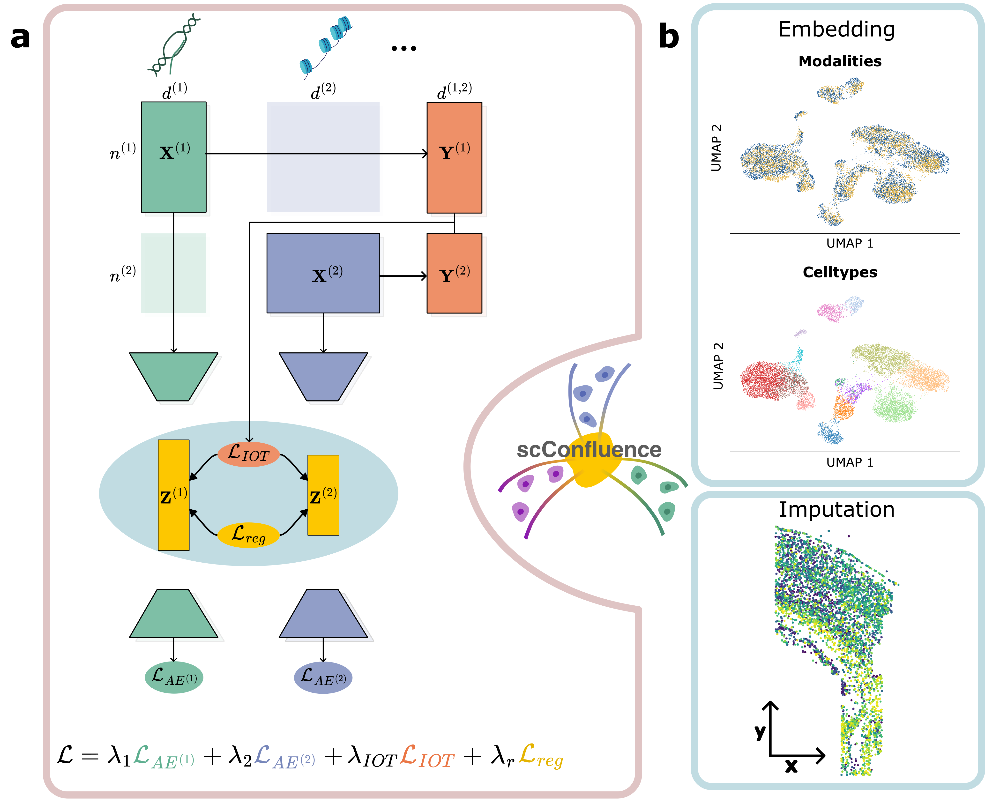

.. scConfluence documentation master file, created by
   sphinx-quickstart on Thu Feb 29 17:10:13 2024.
   You can adapt this file completely to your liking, but it should at least
   contain the root `toctree` directive.

Welcome to scConfluence's documentation!
========================================

.. toctree::
   :hidden:
   :maxdepth: 1
   :glob:
   :caption: Tutorials

   tutorials/*.ipynb

.. toctree::
   :hidden:
   :maxdepth: 3
   :caption: API

   model
   unimodal
   base_module
   nn
   distributions
   dataset_utils

scConfluence is a novel method for the integration of unpaired multiomics data combining
uncoupled autoencoders and Inverse Optimal Transport to learn low-dimensional cell
embeddings. These embeddings can then be used for visualization and clustering, useful
for discovering  subpopulations of cells, and for imputation of features across
modalities.
`Read the preprint! <https://www.biorxiv.org/content/10.1101/2024.02.26.582051v1>`_

Install the package
-------------------

scConfluence is implemented as a Python package seamlessly integrated within the scverse
ecosystem, in particular Muon and Scanpy.

via PyPI
^^^^^^^^

On all operating systems, the easiest way to install scConfluence is via PyPI.
Installation should typically take a minute and is continuously tested with Python 3.10
on an Ubuntu virtual machine.

.. code-block:: bash

   pip install scconfluence

via GitHub (development version)
^^^^^^^^^^^^^^^^^^^^^^^^^^^^^^^^

.. code-block:: bash

   git clone git@github.com:cantinilab/scconfluence.git
   cd scconfluence
   pip install .

Test your development installation (optional)
^^^^^^^^^^^^^^^^^^^^^^^^^^^^^^^^^^^^^^^^^^^^^

.. code-block:: bash

   pip install pytest
   pytest .

Getting started
---------------

scConfluence takes as an input a MuData object and populates its `obsm` field
with the latent embeddings. See tutorials for more detailed examples of applications of the method.

You may download a preprocessed 10X Multiome demo dataset `here <https://figshare.com/s/b0840d90e42e37fa165f>`_.

A GPU is not required for the method to run, but is strongly recommended.

.. code-block:: python

   import scconfluence
   import mudata as md
   import scanpy as sc
   from scipy.spatial.distance import cdist

   # Load data into a Muon object.
   mdata = md.read_h5mu("my_data.h5mu")

   # Compute the cross-modality distance matrix using connected features
   mdata.uns["cross_modality1+modality2"] = cdist(mdata["modality1"].obsm["cm_features"],
                                                  mdata["modality2"].obsm["cm_features"])
   mdata.uns["cross_keys"] = ["cross_modality1+modality2"]

   # Initialize and train the model.
   autoencoders = {"modality1": scconfluence.model.AutoEncoder(mdata["modality1"],
                                                                modality="modality1"),
                   "modality2": scconfluence.model.AutoEncoder(mdata["modality2"],
                                                                modality="modality2")}
   model = scconfluence.model.ScConfluence(mdata, unimodal_aes=autoencoders)
   model.fit(save_path="results")
   mdata.obsm["latent"] = model.get_latent().loc[mdata.obs_names]

   # Visualize the embedding with UMAP.
   sc.pp.neighbors(mdata, use_rep="latent")
   sc.tl.umap(mdata)
   sc.pl.umap(mdata)

Citation
--------

.. code-block:: bibtex

   @article {Samaran2024unpaired,
     author = {Jules Samaran and Gabriel Peyre and Laura Cantini},
     title = {scConfluence : single-cell diagonal integration with regularized Inverse Optimal Transport on weakly connected features},
     year = {2024},
     doi = {10.1101/2024.02.26.582051},
     publisher = {Cold Spring Harbor Laboratory},
     journal = {bioRxiv}
   }
